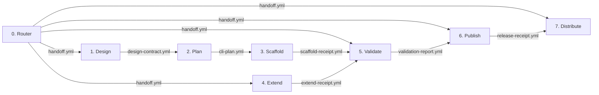

# cli-forge

A unified suite of specialized skills for designing, planning, building,
verifying, and publishing Rust command-line tools.

## Architecture

`cli-forge` uses a structured, multi-stage workflow. Each stage has a singular
responsibility and explicit boundaries, with communication between stages
handled by formal contract files stored in the target project's `.cli-forge/`
directory.



## The 8 Stages

| Stage | Path | Purpose | Key Artifact |
|-------|------|---------|--------------|
| **0. Router** | `./cli-forge/` | Classify user intent, assemble inputs, and explicitly route to the next incomplete stage. | `.cli-forge/handoff.yml` |
| **1. Design** | `./cli-forge-design/` | Define the high-level description, purpose, positioning, and required sync surfaces. | `.cli-forge/design-contract.yml` |
| **2. Plan** | `./cli-forge-plan/` | Translate the design into a detailed CLI contract (commands, flags, capabilities, daemon contract). | `.cli-forge/cli-plan.yml` |
| **3. Scaffold**| `./cli-forge-scaffold/` | Generate the baseline Rust project exclusively using the rules defined in `cli-plan.yml` and the authoritative templates. | `.cli-forge/scaffold-receipt.yml` |
| **4. Extend** | `./cli-forge-extend/` | Add optional features (`stream`, `repl`, `daemon`) to an existing project and update the plan. | `.cli-forge/extend-receipt.yml` |
| **5. Validate**| `./cli-forge-validate/` | Run 28 compliance checks against the projected generated codebase to block invalid artifacts from release. | `.cli-forge/validation-report.yml` |
| **6. Publish** | `./cli-forge-publish/` | Manage the primary repo-native GitHub Release pipeline and automation assets. | `.cli-forge/release-receipt.yml` |
| **7. Distribute**|`./cli-forge-distribute/`| (Optional) Execute secondary npm publication using a platform-specific package model. | *N/A (terminal stage)* |

## Single Source of Truth

To ensure consistency across the entire workflow, `cli-forge` relies on single
sources of truth:

1. **`planning-brief.md`**: Found in the repository root, this file dictates
   the rules every generated skill must follow (e.g., must have a single CLI
   entrypoint, must use stderr for structured errors).
2. **`templates/`**: All source code templates live exclusively in the root
   `templates/` directory. No stage maintains local copies of templates.
   - `templates/scaffold/`: Baseline Rust project setup
   - `templates/extensions/`: Feature module additions
   - `templates/publish/`: Un-templated release automation assets
3. **`contracts/*.tpl`**: The templates for inter-stage communication artifacts.

## Usage

You do not need to call the individual stages manually. Start every interaction
by invoking the parent Router skill against your objective:

```text
Hey, I want to use cli-forge to create a new Rust tool that formats JSON.
```

The Router will classify the intent as `design` and hand you over to the Design
stage. If interrupted, you can resume at any time:

```text
Continue with the cli-forge workflow.
```

The Router will inspect your project's `.cli-forge/` directory and route you
automatically to the next incomplete stage.
