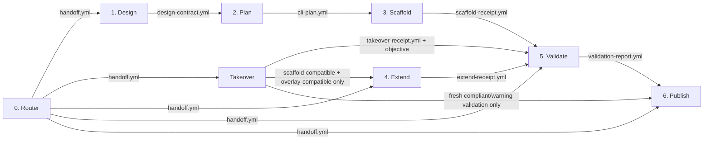

# cli-forge

A unified suite of specialized skills for designing, planning, building,
verifying, and publishing Rust command-line tools.

## Architecture

`cli-forge` uses a structured, multi-stage workflow. Each stage has a singular
responsibility and explicit boundaries, with communication between stages
handled by formal contract files stored in the target project's `.cli-forge/`
directory. For existing repositories that predate `cli-forge`, the workflow
also provides a dedicated takeover recovery path that reconstructs the missing
contracts before validation or later work continues. Takeover does not by
itself normalize an arbitrary repository into the scaffold-compatible layout
or overlay API/dependency surface required by template-based feature
expansion.
Takeover records observed current behavior in the recovered contracts rather
than silently upgrading the project to cli-forge defaults, and any refresh
that rewrites `cli-plan.yml` makes the prior validation report stale for
Publish gating until Validate runs again. The same stale-report rule applies
when Takeover changes `.gitignore` or any other validation-covered baseline
surface during baseline establishment or refresh.
Takeover can also be used to establish a missing adopted baseline receipt or
to refresh previously adopted contracts when the user asks for that recovery
path explicitly.



## The 7 Core Stages + Takeover Recovery

| Stage           | Path                    | Purpose                                                                                                                   | Key Artifact                       |
| --------------- | ----------------------- | ------------------------------------------------------------------------------------------------------------------------- | ---------------------------------- |
| **0. Router**   | `./cli-forge/`          | Classify user intent, assemble inputs, and explicitly route to the next incomplete stage.                                 | `.cli-forge/handoff.yml`           |
| **1. Design**   | `./cli-forge-design/`   | Define the high-level description, purpose, positioning, and required sync surfaces.                                      | `.cli-forge/design-contract.yml`   |
| **2. Plan**     | `./cli-forge-plan/`     | Translate the design into a detailed CLI contract (commands, flags, capabilities, daemon contract).                       | `.cli-forge/cli-plan.yml`          |
| **3. Scaffold** | `./cli-forge-scaffold/` | Generate the baseline Rust project exclusively using the rules defined in `cli-plan.yml` and the authoritative templates. | `.cli-forge/scaffold-receipt.yml`  |
| **Takeover**    | `./cli-forge-takeover/` | Adopt an existing project that lacks a usable `cli-forge` contract baseline by reconstructing the required pipeline files from its implementation and choosing the next stage from the recorded objective. | `.cli-forge/takeover-receipt.yml`  |
| **4. Extend**   | `./cli-forge-extend/`   | Add optional features (`stream`, `repl`) to an existing project that already matches the scaffold-compatible layout and the overlay API/dependency surface those templates require, then update the plan. | `.cli-forge/extend-receipt.yml`    |
| **5. Validate** | `./cli-forge-validate/` | Run 47 compliance checks against the projected generated codebase, including an explicit command-tree audit that forbids hybrid leaf-plus-container paths, to block invalid artifacts from release. | `.cli-forge/validation-report.yml` |
| **6. Publish**  | `./cli-forge-publish/`  | Manage the release automation that produces the GitHub Release, binaries, release evidence, and npm publication together. | `.cli-forge/release-receipt.yml`   |

## Artifact Policy

The `.cli-forge/` directory contains intermediate pipeline contract files
(`handoff.yml`, `design-contract.yml`, `cli-plan.yml`, receipts, reports). These
files are **transient build-time artifacts** and **must not** be committed to
git — neither in this repository nor in any generated target project. Both this
repository's `.gitignore` and the scaffold template's `.gitignore.tpl` enforce
this rule automatically, and the Takeover stage must add the ignore entry when
adopting older repositories that do not already have it.

## Bundled Stage Assets

Each `cli-forge-*` stage directory now carries the resources it needs locally
so the installed skills remain self-contained:

1. **Local planning briefs**: every stage that needs the shared planning rules
   ships its own `planning-brief.md` copy; Publish also carries its active
   stage-specific brief, and Distribute keeps an archived historical brief.
2. **Local contracts**: every stage that writes pipeline artifacts ships the
   specific `contracts/*.tpl` files it needs inside its own `contracts/`
   directory.
3. **Local templates**: stages that expand code or release assets ship their
   own `templates/` directory inside that stage package.

This layout intentionally favors installability over a shared root asset pool:
the repository structure mirrors the expected installed-skill shape so no stage
depends on root-level `contracts/`, `templates/`, or `planning-brief.md` files
at runtime.

## Archived Reference

`./cli-forge-distribute/` is retained only as archived reference material from
the earlier split-stage release design. New workflows should not route there:
npm publication now belongs to Publish.

## Daemon Design

The Plan stage now models daemon behavior as an optional app-server capability.
The detailed planning reference lives at
[`./cli-forge-plan/instructions/daemon-app-server.md`](./cli-forge-plan/instructions/daemon-app-server.md)
and defines long-lived background execution plus client-routed command
execution. The legacy managed-daemon placeholder has been removed from the
default scaffold baseline. Daemon generation itself is still future work, so a
plan that marks `daemon` `in_scope` currently needs dedicated scaffold support
before generated artifacts can claim end-to-end parity with that contract.

## Usage

You do not need to call the individual stages manually. Start every interaction
by invoking the parent Router skill against your objective:

```text
Hey, I want to use cli-forge to create a new Rust tool that formats JSON.
```

The Router will classify the intent as `design` and hand you over to the Design
stage using a dialog-based next-step choice instead of asking you to type a
skill name or reply to a numbered text menu. If interrupted, you can resume at
any time:

```text
Continue with the cli-forge workflow.
```

The Router will inspect your project's `.cli-forge/` directory, or the existing
Rust CLI project layout when the contracts are missing, and route you
automatically to the next incomplete or takeover stage. If
`design-contract.yml` already exists but `cli-plan.yml` does not, it resumes
Plan instead of re-running Takeover. It then presents dialog-style approval or
continuation options instead of requiring exact-text replies or typed
sequence-number input.

For an existing repository that already contains a Rust CLI project but lacks
the `cli-forge` contracts, the Router should classify the work as `takeover`,
reconstruct `design-contract.yml` and `cli-plan.yml` from the current
implementation, write `takeover-receipt.yml`, and then choose the next stage
from the recorded objective. Validate is the default continuation, Publish can
be chosen only when takeover preserved the approved contracts without
rewriting them during `baseline_establishment`, preserved validation-covered
baseline surfaces such as `.gitignore` without changing them, and a fresh
compliant/warning validation report whose provenance still matches the current
contract and receipt set already exists. Extend is allowed only when the
adopted repository already matches the scaffold-compatible files and overlay
API/dependency surface that the feature templates patch or call directly,
including `src/context.rs`, `resolve_runtime_locations`, and `rustyline` for
the REPL path.
If the contracts already exist but the adopted baseline receipt is missing, or
the user explicitly asks to refresh the adopted contracts, the Router should
still use Takeover with a structured takeover mode so the recovery path remains
valid instead of dead-ending on a first-adoption-only interpretation.
