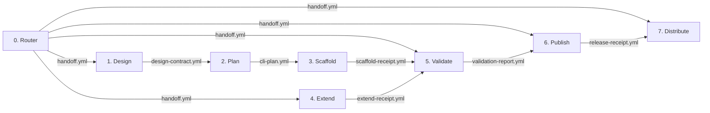

# cli-forge

A unified suite of specialized skills for designing, planning, building,
verifying, and publishing Rust command-line tools.

## Architecture

`cli-forge` uses a structured, multi-stage workflow. Each stage has a singular
responsibility and explicit boundaries, with communication between stages
handled by formal contract files stored in the target project's `.cli-forge/`
directory.



## The 8 Stages

| Stage             | Path                      | Purpose                                                                                                                   | Key Artifact                       |
| ----------------- | ------------------------- | ------------------------------------------------------------------------------------------------------------------------- | ---------------------------------- |
| **0. Router**     | `./cli-forge/`            | Classify user intent, assemble inputs, and explicitly route to the next incomplete stage.                                 | `.cli-forge/handoff.yml`           |
| **1. Design**     | `./cli-forge-design/`     | Define the high-level description, purpose, positioning, and required sync surfaces.                                      | `.cli-forge/design-contract.yml`   |
| **2. Plan**       | `./cli-forge-plan/`       | Translate the design into a detailed CLI contract (commands, flags, capabilities, daemon contract).                       | `.cli-forge/cli-plan.yml`          |
| **3. Scaffold**   | `./cli-forge-scaffold/`   | Generate the baseline Rust project exclusively using the rules defined in `cli-plan.yml` and the authoritative templates. | `.cli-forge/scaffold-receipt.yml`  |
| **4. Extend**     | `./cli-forge-extend/`     | Add optional features (`stream`, `repl`) to an existing project and update the plan.                                      | `.cli-forge/extend-receipt.yml`    |
| **5. Validate**   | `./cli-forge-validate/`   | Run 46 compliance checks against the projected generated codebase to block invalid artifacts from release.                | `.cli-forge/validation-report.yml` |
| **6. Publish**    | `./cli-forge-publish/`    | Manage the primary repo-native GitHub Release pipeline and automation assets.                                             | `.cli-forge/release-receipt.yml`   |
| **7. Distribute** | `./cli-forge-distribute/` | (Optional) Execute secondary npm publication using a platform-specific package model.                                     | _N/A (terminal stage)_             |

## Artifact Policy

The `.cli-forge/` directory contains intermediate pipeline contract files
(`handoff.yml`, `design-contract.yml`, `cli-plan.yml`, receipts, reports). These
files are **transient build-time artifacts** and **must not** be committed to
git — neither in this repository nor in any generated target project. Both this
repository's `.gitignore` and the scaffold template's `.gitignore.tpl` enforce
this rule automatically.

## Bundled Stage Assets

Each `cli-forge-*` stage directory now carries the resources it needs locally
so the installed skills remain self-contained:

1. **Local planning briefs**: every stage that needs the shared planning rules
   ships its own `planning-brief.md` copy, and publish/distribute also carry
   their stage-specific briefs.
2. **Local contracts**: every stage that writes pipeline artifacts ships the
   specific `contracts/*.tpl` files it needs inside its own `contracts/`
   directory.
3. **Local templates**: stages that expand code or release assets ship their
   own `templates/` directory inside that stage package.

This layout intentionally favors installability over a shared root asset pool:
the repository structure mirrors the expected installed-skill shape so no stage
depends on root-level `contracts/`, `templates/`, or `planning-brief.md` files
at runtime.

## Daemon Design

The Plan stage now models daemon behavior as an optional app-server capability.
The detailed planning reference lives at
[`./cli-forge-plan/instructions/daemon-app-server.md`](./cli-forge-plan/instructions/daemon-app-server.md)
and defines long-lived background execution plus client-routed command
execution. The legacy managed-daemon placeholder has been removed from the
default scaffold baseline. Daemon generation itself is still future work, so a
plan that marks `daemon` `in_scope` currently needs dedicated scaffold support
before generated artifacts can claim end-to-end parity with that contract.

## Usage

You do not need to call the individual stages manually. Start every interaction
by invoking the parent Router skill against your objective:

```text
Hey, I want to use cli-forge to create a new Rust tool that formats JSON.
```

The Router will classify the intent as `design` and hand you over to the Design
stage using a dialog-based next-step choice instead of asking you to type a
skill name or reply to a numbered text menu. If interrupted, you can resume at
any time:

```text
Continue with the cli-forge workflow.
```

The Router will inspect your project's `.cli-forge/` directory and route you
automatically to the next incomplete stage, then present dialog-style approval
or continuation options instead of requiring exact-text replies or typed
sequence-number input.
